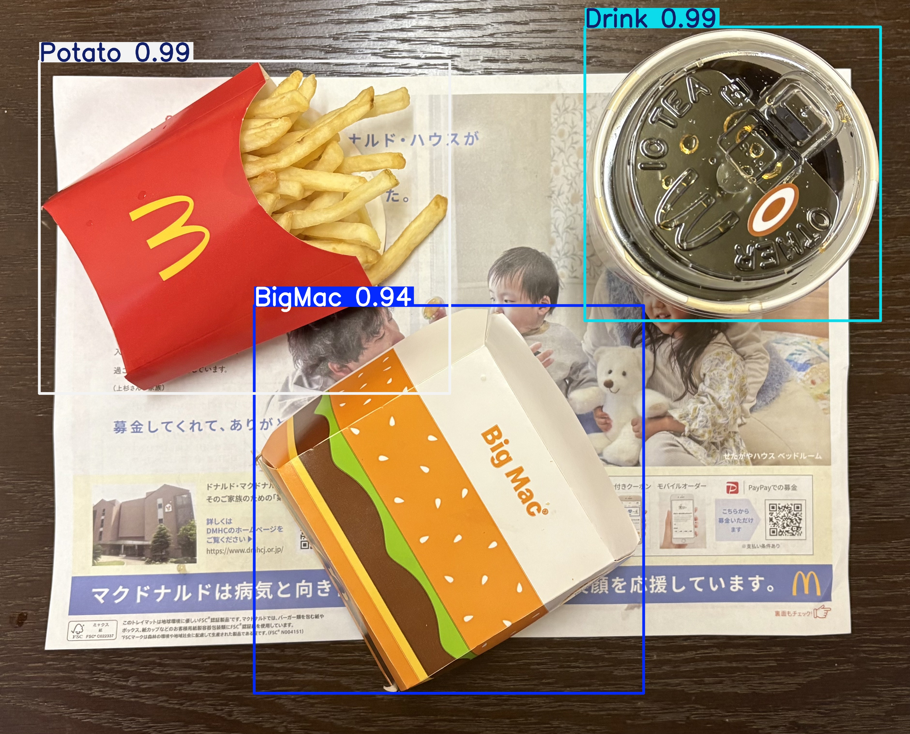

# YOLO マクドナルド物体検出：AI学習の記録
# YOLO McDonald's Detection: An AI Learning Journey 

## サマリー
### 1. プロジェクトの概要
機械工学からAIエンジニアリングへの移行を目指す過程で構築した、YOLOベースの「マクドナルドメニュー物体検出」モデルです。実践的なコンピュータビジョンの基礎を習得するための学習記録として作成しました。

### 技術的アプローチと課題解決
データ不足の課題を克服するため、独自のアプローチを採用しました。収集した50枚の実画像のうち10枚を検証データとして切り出し、残りの画像に200枚の合成画像（Synthetic Data）を組み合わせて学習データを拡張しました。このデータセットを用いてYOLOの学習パイプラインを一から構築し、小規模データにおける過学習の防止やモデルの重みの選定について実践的に学びました。

### 検証結果と今後の展望
選定した10枚の検証データに対するモデルの評価結果は以下の通りです。
| Class | Images | Instances | Precision | Recall | mAP@50 | mAP@50-95 |
| :--- | :--- | :--- | :--- | :--- | :--- | :--- |
| **All (总体)** | 10 | 30 | 0.992 | 1.000 | 0.995 | 0.995 |
| **BigMac (巨无霸)** | 5 | 5 | 0.990 | 1.000 | 0.995 | 0.995 |
| **Drink (饮料)** | 9 | 9 | 0.993 | 1.000 | 0.995 | 0.995 |
| **Potato (薯条)** | 7 | 7 | 0.991 | 1.000 | 0.995 | 0.995 |
| **Teriyaki (照烧堡)**| 9 | 9 | 0.995 | 1.000 | 0.995 | 0.995 |

今後は、FastAPIとStreamlitを用いたローカル環境へのデプロイ（Webアプリ化）を行うとともに、VLM（視覚言語モデル）を探求し、画像から自動的に栄養素の要約やレシートを生成するシステムへの拡張を目指します。

## 日本語

###  プロジェクトの背景
このプロジェクトは、私のコンピュータビジョン（CV）と物体検出における実践的な学習の記録です。機械工学のバックグラウンドからAIエンジニアリング領域への移行を目指す中で、AIの実装への理解を深めるためにこの課題に取り組みました。単なる完成品の展示ではなく、YOLOモデルを用いてマクドナルドのトレイ上のメニューを認識させる過程での「実験・失敗・成長」をまとめたリポジトリです。

###  学んだこと

#### 1. 「データ不足」の壁と解決策
AI開発において、データがモデルと同等に重要であるということを身をもって学びました。
*   **実データ:** まず、マクドナルドのトレイ画像の**50枚の実画像**を収集し、手動でアノテーション（タグ付け）を行いました。
*   **合成データの生成:** 50枚ではロバストな検出には不十分であり、手作業でのアノテーションには限界があることに気づきました。そこでデータ拡張のアプローチを調査し、**200枚の合成画像（Synthetic Data）**を生成・追加しました。これにより、CVプロジェクトにおけるデータボトルネックの創造的な解決方法を学びました。

#### 2. モデルの重み（Weights）の理解
当初、モデルの重みファイルについて混乱していました。実験を通じて、YOLOの各バージョンのトレードオフを理解しました。主に推論速度の速い `nano`（`n`）バージョンでベースラインを検証し、独自のデータセットで学習させることで生成される専用の `best.pt` の意味と価値を学びました。

#### 3. 学習パイプラインの構築
*   環境構築と `data.yaml` の適切な設定。
*   損失関数（Loss）や mAP の意味、学習曲線の読み方の理解。
*   小規模なカスタムデータセットにおける過学習（Overfitting）の防止。

###  今後の学習の展望
*   FastAPIとStreamlitを使用してこのモデルをローカル環境にデプロイし、インタラクティブなWebアプリを構築する。
*   Vision-Language Model (VLM) の技術を探求し、単なる物体検出にとどまらず、画像から自動的に栄養素の要約や「レシート」を生成するシステムを開発する。

---
## English

###  About This Project
This project documents my hands-on learning experience in Computer Vision and Object Detection. Coming from a mechanical engineering background, I built this project to deepen my practical understanding of AI engineering. Rather than just a showcase of a finished product, this repository is a record of my experiments, failures, and growth in training a YOLO model to recognize food items on McDonald's meal trays.

###  What I Learned

#### 1. Overcoming the "Data Scarcity" Challenge
One of the biggest lessons was understanding that *data is just as important as the model*. 
*   **Real Data:** I started by manually collecting and annotating **50 real images** of McDonald's meal trays. 
*   **Synthetic Data Generation:** Realizing 50 images weren't enough for robust detection, and manual annotation is time-consuming, I researched data augmentation. I successfully generated **200 synthetic annotated images**, blending AI-generated elements with real backgrounds. This taught me how to creatively solve data bottleneck issues in CV projects.

#### 2. Understanding Model Weights (yolo11n vs. others)
Initially, I was confused about model weights. Through experimentation, I learned the trade-offs between different YOLO versions. I primarily experimented with the `nano` (`n`) version to understand the baseline for fast inference, and learned how custom training produces a `best.pt` checkpoint optimized for my specific McDonald's dataset.

#### 3. The Training Pipeline
*   Setting up the environment and configuring `data.yaml`.
*   Understanding loss functions, mAP (mean Average Precision), and how to read training graphs.
*   Preventing overfitting when working with a relatively small custom dataset.

###  Next Steps in My AI Journey
*   Deploy this model locally using FastAPI and Streamlit to create an interactive web interface.
*   Explore Vision-Language Models (VLMs) to not just detect the food, but automatically generate nutritional summaries or "receipts".
